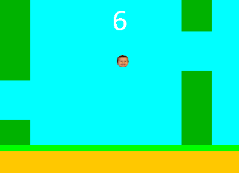
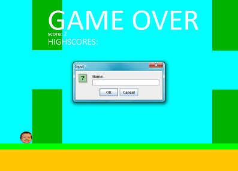

# FlappyMareczek

It's an app based on a popular game "Flappy Bird".
Created by me while learning java. 
Player has to press SPACE to keep the bird flapping his wings.
In this version I use my little cousin's face to interest him and give fun.
Mayby not a very complicated app but seeing a smile of a child playing that game
makes my work well done.
  

Language: JAVA

IDE: NetBeans 8.1
  

If u have any questions please contact me on pprzybyt@gmail.com

  
  
   
    

